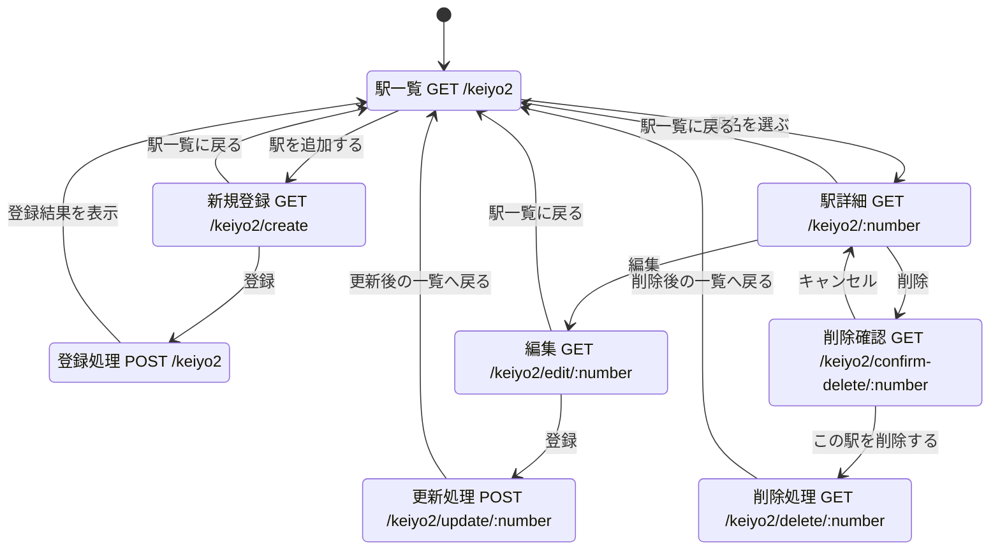

# 第10回 京葉線アプリのページ遷移

`node app5.js` でサーバを起動し、ブラウザで `http://localhost:8080/keiyo2` を開く。

```mermaid
stateDiagram-v2
    state "駅一覧 GET /keiyo2" as List
    state "駅詳細 GET /keiyo2/:number" as Detail
    state "新規登録 GET /keiyo2/create" as CreateForm
    state "登録処理 POST /keiyo2" as Create
    state "編集 GET /keiyo2/edit/:number" as Edit
    state "更新処理 POST /keiyo2/update/:number" as Update
    state "削除確認 GET /keiyo2/confirm-delete/:number" as Confirm
    state "削除処理 GET /keiyo2/delete/:number" as Delete

    [*] --> List
    List --> Detail: 駅名を選ぶ
    Detail --> List: 駅一覧に戻る
    List --> CreateForm: 駅を追加する
    CreateForm --> Create: 登録
    CreateForm --> List: 駅一覧に戻る
    Create --> List: 登録結果を表示
    Detail --> Edit: 編集
    Edit --> Update: 登録
    Edit --> List: 駅一覧に戻る
    Update --> List: 更新後の一覧へ戻る
    Detail --> Confirm: 削除
    Confirm --> Detail: キャンセル
    Confirm --> Delete: この駅を削除する
    Delete --> List: 削除後の一覧へ戻る
```

`:number` は駅データの配列内の位置で、駅IDとは別に扱う。削除の確認画面では駅名と駅コードを表示し、実行時には対象の駅IDも照合する。
